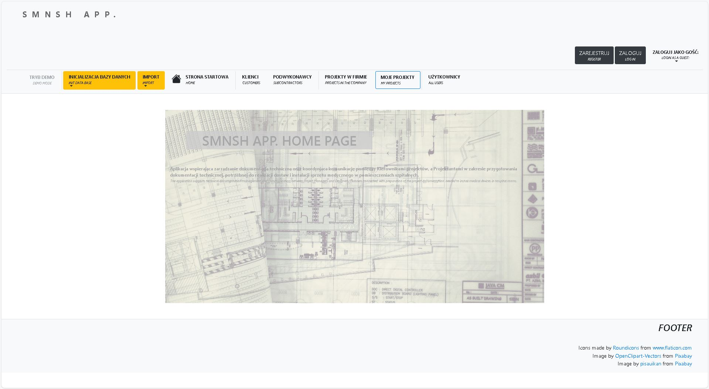
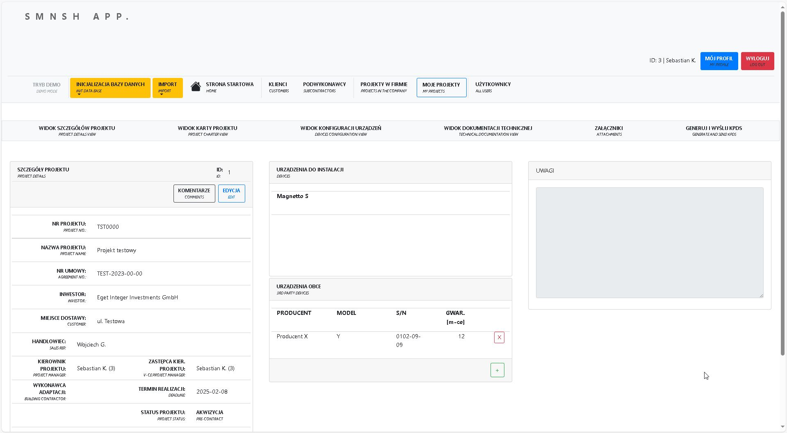
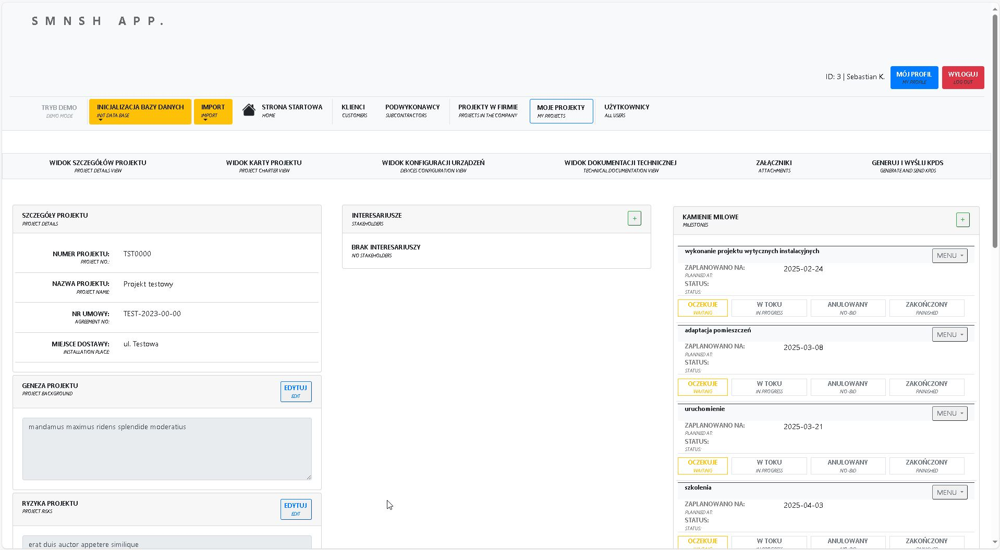

#### INTRODUCTION

SMNSH is a code name of the application which was inspired by real life project management challenges in the Hospital Technology industry. The main goal of the app is to accelerate procedures inside a team of project managers and designers. Additionally, the intention is to gather all information in one place and simplify the process of sharing data between departments. 

The primary functionality is:
- user login,
- create projects connected with investor, customer and installation place,
- set a project manager and assistant of the project manager,
- set and manage milestones of the project,
- set and manage stakeholders of the project,
- collect important attachments,
- create automatic pdf files needed by other departments,
- edit data.

#### LATEST VERSION DESCRIPTION  

 #4.0.JANUARY version has been created to test and deploy in January 2025.

#### TECHNOLOGY

* Java/Spring  
* Hibernate/MySQL  
* JavaScript/jQuery/Ajax  
* HTML/CSS/Bootstrap  

#### SCREENSHOTS

<!---->

**HOME PAGE**  
   
**PROJECT DETAILS PAGE**  
   
**PROJECT CHATER PAGE**  
   

#### STATUS AND TODO LIST

**STATUS:** *in progress*

**TODO LIST:**  

* encryption functionality

* front end updates  
    * init data visible only for admin (?)  
    * hide import data button (?)  
    * add placeholder for description when creating new project  
    * update back button for edit milestone and make a font bigger for a title  
    * remove lorem ipsum data for project background etc. when creating new project  
    * hide configuration menu (?)
    * attachment page  

* technical documentation functionality to update  

* training as a list  
    * add to the project charter page 

* company updates  
    * create a company quality rate edit functionality  
    * create a contact details edit functionality  

* export data to kpds  
    * generate kpds to a pdf file and prepare for download  

* 3rd party functionality:  
    * create a tooltip with description  
    * edit 3rd party device functionality  

* add default stakeholders to new project (?)  
    * edit stakeholder 

* import from xls  
    * project from xls  
    * company from xls  
    * import clients from xls 

* PL charset unicode problem when save to MySQL  

#### CONTACT

*krzysztofskul@protonmail.com*