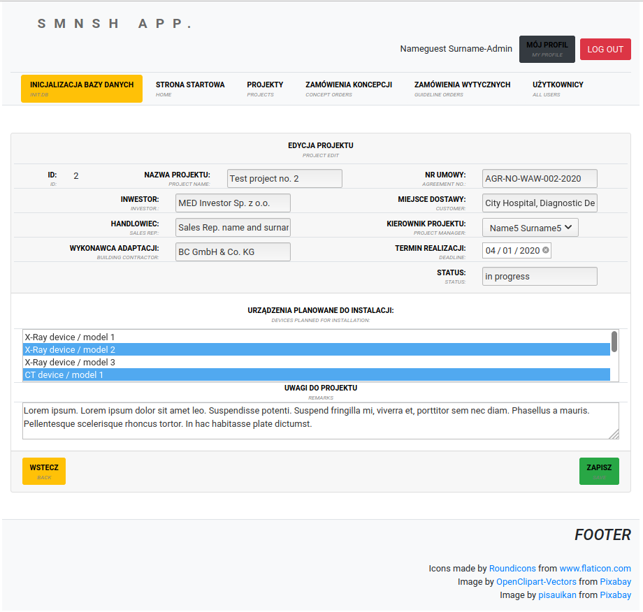

# SMNSH (in progress..)

    http://smnshtest2-env.eba-mhppknzr.us-east-2.elasticbeanstalk.com/

  <!---->
  

## IDEA / *IDEA*

Aplikacja wspiera zarządzanie dokumentacją techniczną oraz komunikację pomiędzy Project Manager'ami, a Projektantami/Planistami w zakresie przygotowania dokumentacji projektowej, potrzebnej do instalacji sprzętu medycznego w pomieszczeniach szpitalnych.

*The application supports technical documentation management and communication between Project Managers and Designers/Planners connected, with preparation of the project documentation, needed to medical devices installation in hospital rooms.*
 
## PODSTAWOWE FUNCKJONALNOŚĆI I MOŻLIWOŚCI / *MAIN FUNCTIONS AND CAPABILITIES*
 - Tworzenie projektu dostawy sprzętu medycznego / *Medical devices supplies' project development*
    - Przypisywanie sprzętu z bazy danych wg kategorii / *Medical devices from database assignment to the project based on category*
    - Zarządznie statusam projektu  / *Statuses' project managemennt*
    - Dodawanie podkładów architektonicznych w formie załącznika / * Attach architectural layout addition*
 - Wyświetlanie projektów wg aktualnego status / *Displaying projects based on actual status*
 - Zamawianie rysunków koncepcyjnych i wytycznych posadowienia sprzętu / *Making orders of medical devices' conceptual drawings and installation guidelines*
    - Walidacja wymaganych danych wejściowych do wykonania rysnku / *Necessary data needed to prepare drawing validation*
 - Przypisywanie projektanta do zamówienia / *Assingning designer to the order*
 - Wyświetlanie projektanta opracowującego rysunek / *Displaying designer preparing the drawing*
 - Wyświetlanie aktualnego statusu opracowania zamówienia / *Displaying the current status of the order under preparation*
 
## UŻYTE TECHNOLOGIE / *USED TECHNOLOGIES*
 - Java
     - Spring MVC
     - JPA, Hibernate
 - MySQL
 - HTML, JSP, JSTL, CSS, JS, BootStrap
 - Intellij

## ZRZUTY EKRANU / *SCREENSHOTS*

-  Karta projektu / *Project card*

  
  
  
  

- Rejestracja nowego użytkownika
| *New user registration page*

  <!---->
  

- Strona użytkownika
| *User's profile page*

  <!---->
  
  
- Formularz nowego zamówienia projektu koncepcyjnego
| *The form for order a new preliminary (conceptual) design* 

  <!---->
  

- Przypisanie projektanta do zamówienia rysunku koncepcyjnego | *Setting up a designer to the order for preliminary (conceptual) design*

  <!---->
  

- Zmiana statusu zamówienia | *Changing the status of the order*

  <!---->
  

- Zamówienie wykonania wytycznych instalacyjnych | *The order form for final planning design*

  <!---->
  