# SMNSH (in progress..)

  <!--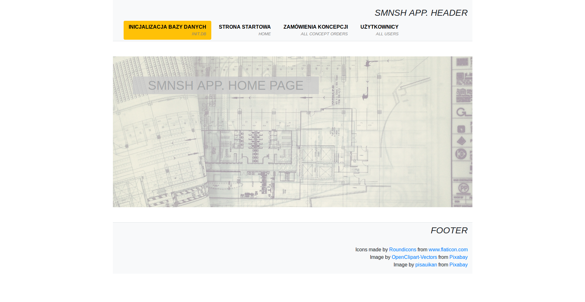-->
  

## IDEA / *IDEA*

Aplikacja wspiera zarządzanie dokumentacją techniczną oraz komunikację pomiędzy Project Manager'ami, a Projektantami/Planistami w zakresie przygotowania dokumentacji projektowej, potrzebnej do instalacji sprzętu medycznego w pomieszczeniach szpitalnych.

*The application supports technical documentation management and communication between Project Managers and Designers/Planners connected, with preparation of the project documentation, needed to medical devices installation in hospital rooms.*
 

## SCHEMAT DZIAŁANIA / *WORKFLOW*

**Kierownik projektu / Project Manager**

- Zarejestruj/zaloguj się jako Project Manager
| *Register/log in as a Project Manager*
  ###
  <!--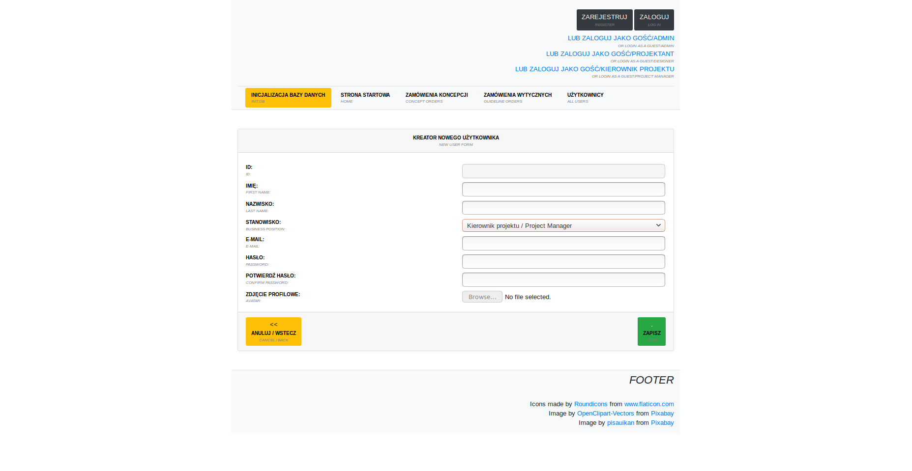-->
  

- Wejdź na swój profil
| *Go to your profile page*
  ###
  <!--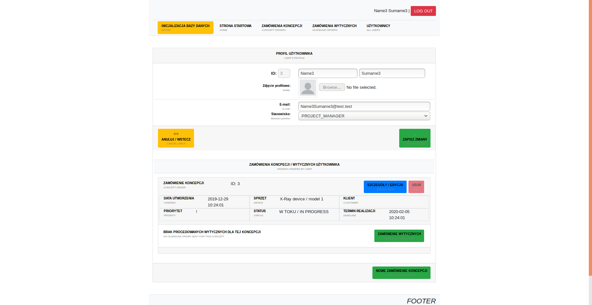-->
  
  
- Utwórz nowe zamówienie projektu koncpecyjnego
| *Create a new order for a conceptual project* 
  ###
  <!--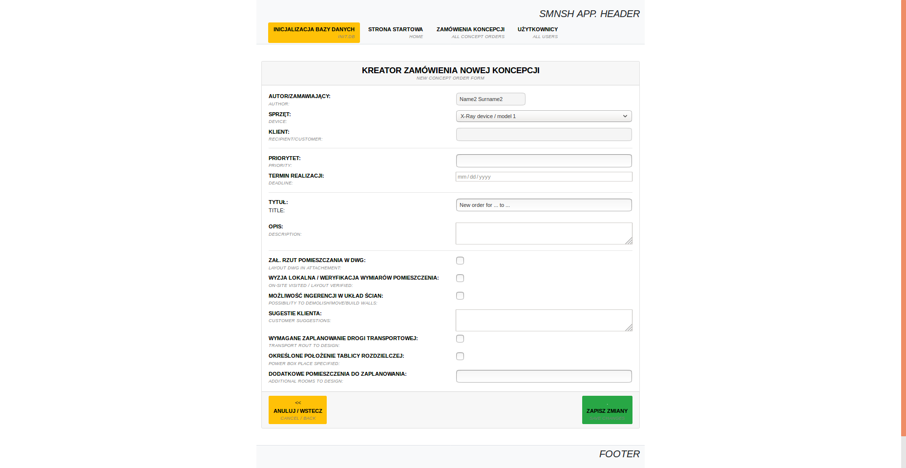-->
  
  
- Wypełnij dodatkowy formularz dot. tematów zależnych od rodzaju sprzętu
| *Fill in additional questionnaire containing issues depended on device category*
    ###
    <!--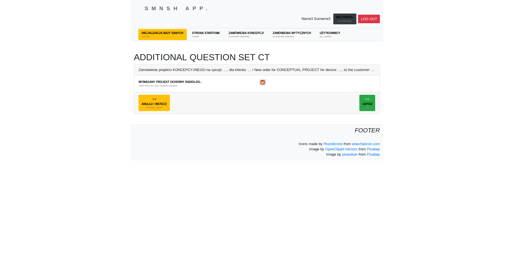-->
    
    
    <!--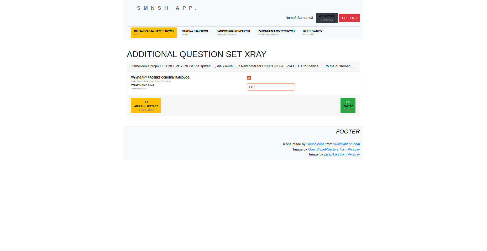-->
    
        
    <!---->
    

**Projektant/Planista / Designer/Planner**

- Zarejestruj/zaloguj się jako Projektant/Planista
| *Register/log in as a Designer/Planner*
  
  <!--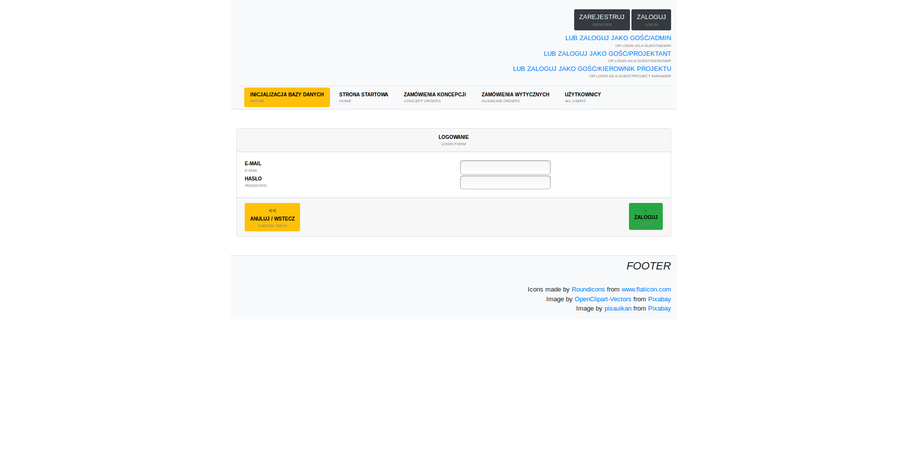-->
  
  
- Wejdź na stronę z listą koncepcji "oczekujących do wykonania" | *Go to conceptual projects page with "waiting for prepare" status*

  ###
  <!--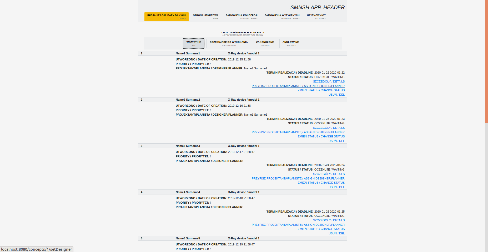-->
  

- Oznacz się jako Projektant/Planista wykonujący koncepcję | *Set up yourself as a Designer/Planner with this conceptual project*

  <!--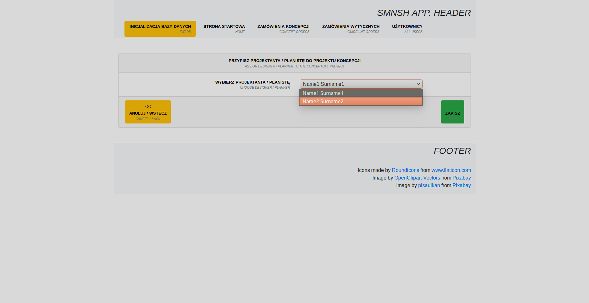-->
  

- Po zakończonym projekcie oznacz status koncepcji jako "wykonane" | *When you finnish, mark the status of the concept as "finished"*

  <!--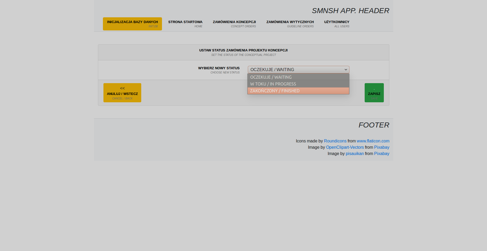-->
  

**Kierownik projektu / Project Manager**

- Dla wykonanych projektów koncepcji, utwórz zamówienie wykonania wytycznych instalacyjnych | *For finished concept designs, create new order for installation guidelines design*

  <!--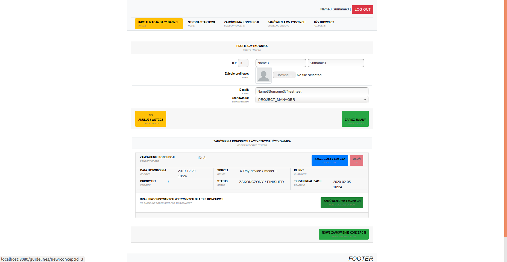-->
  
  
## KARTA PROJEKTU / *PROJECT CARD*

    w toku... / in progress...

  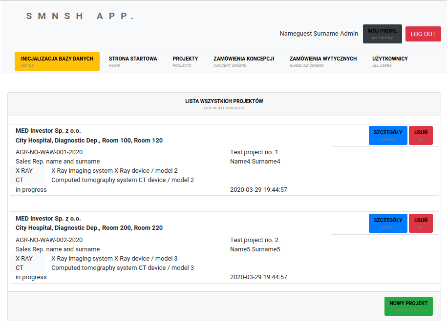
  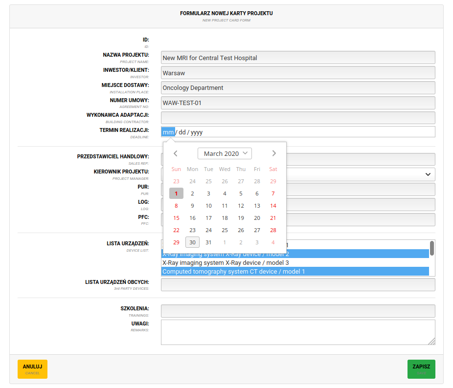
  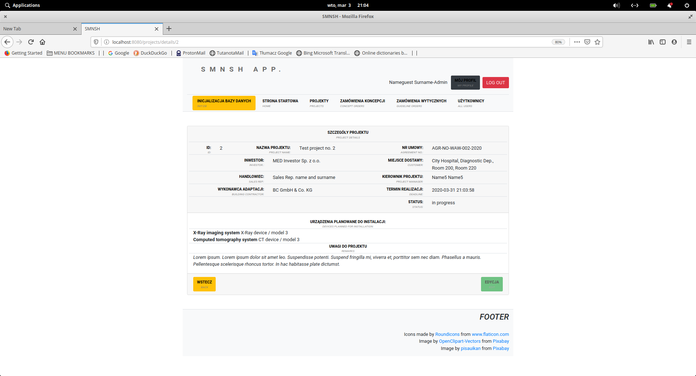